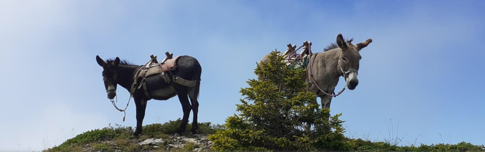
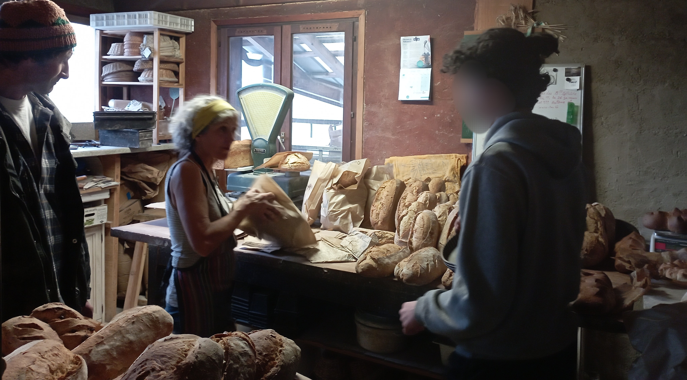
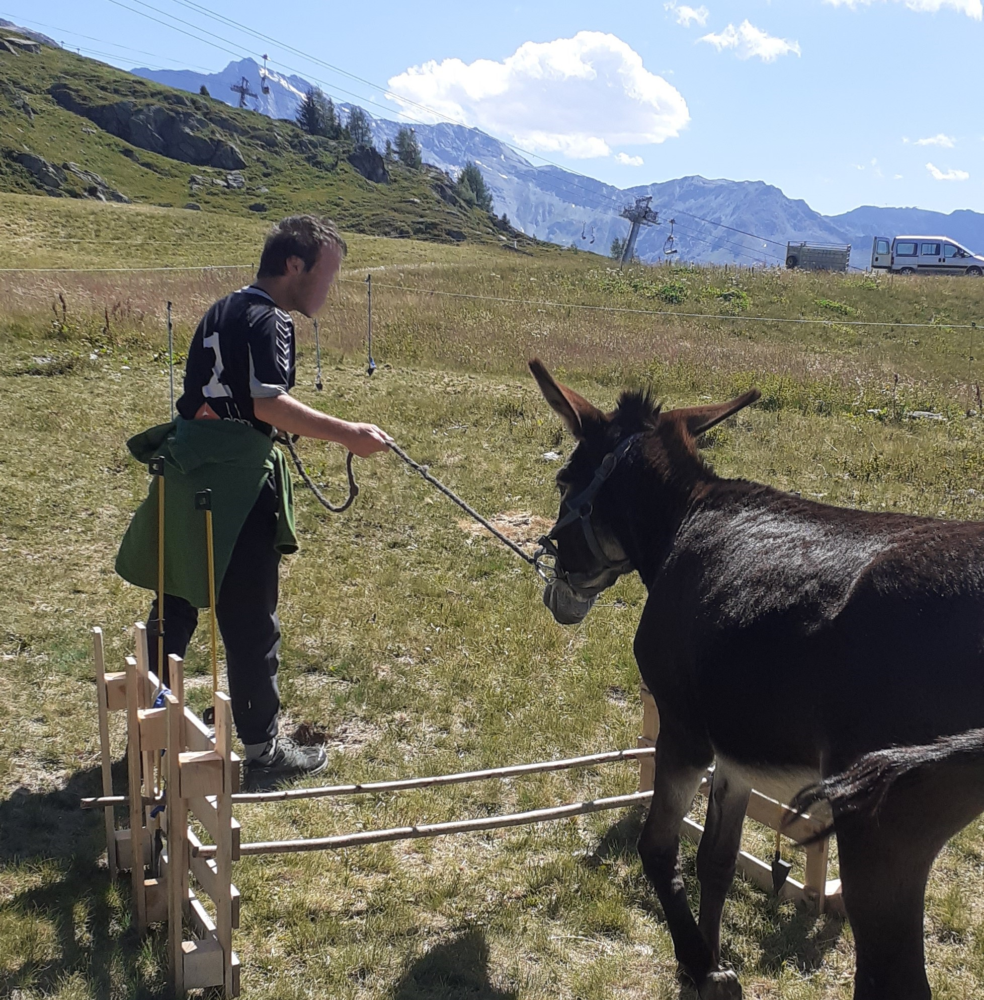

# Objectif de la cab’âne:
Les piliers de la cab’âne : 

Découvrir – Partager - Responsabiliser

Proposition de séjours de remobilisation allant de un à plusieurs mois à destination de jeunes en décrochage avec leur projet scolaire et/ou professionnel et en difficulté avec leur milieu de vie habituel. 
image: activite-bois.jpg
- Pour des jeunes de 13 à 18 ans.
- Un Lieu pour souffler et prendre du temps, tant sur le plan personnel que professionnel
- Un  accompagnement individuel (possibilité d’accueillir 2 jeunes maximum)
- Immersion dans un cadre de vie familiale 
- Une Pédagogie: Le “faire-avec” autour d’activités paysannes et médiation animale (animaux de basse cour et Asinerie)

## Découvrir …
- Ses qualités et ses talents 
- De nouveaux savoir-faire / savoir-être
- De nouveaux horizons, en rencontrant des personnes passionnées par leur métier
- De nouvelles perspectives de travail ou de scolarité par la mise en lien des savoirs théoriques et pratiques
    ###   … à travers des ateliers pratiques et concrets 

  ## Partager…
- Du temps dans le quotidien, des expériences de la vie  
- Des moments conviviaux: sobres et joyeux
- Des pratiques et des postures professionnelles avec les partenaires de la Cab’âne
- Des chemins de vie différents porteurs de sens 
- Des activités proches de la terre
     ###    … avec un réseau de personnes enracinées dans leur territoire 

## Responsabiliser…

Grâce à la médiation animale,
en lui donnant des tâches à faire lors des différentes activités proposées
Par une pédagogie de mise en responsabilité régulière et adaptée au rythme du jeune
En travaillant ses perspectives concrètes sur son avenir scolaire et/ou Professionnel pour un retour progressif dans son milieu de vie
  ###    … pour lui donner un nouvel élan, le mettre en confiance pour  se sentir capable et responsable .

## Modalités d'accueil

Depuis mars 2024 nous accueillons, exclusivement pour des séjours,  des jeunes qui nous sont confiés par le département de la Savoie.
Pour toutes autres demandes d'accompagnement éducatif, merci de nous contacter.

